<h1 align="center">Philemon Ativor</h1>

  <b>Software Engineer • Backend & Platform</b>

  I build reliable APIs, data systems, authentication infrastructure, and backend products.

  <a href="mailto:pa4ativor@gmail.com">Email</a> •
  <a href="https://www.linkedin.com/in/philemon-ativor-48319a2a1">LinkedIn</a>

---

## 👨🏾‍💻 About Me

I'm a backend-focused software engineer working primarily with **TypeScript, Python, and PostgreSQL**.

I enjoy building systems around APIs, authentication, databases, background processing, and real-world business workflows.

- 📍 Based in New Jersey
- ⚙️ Interested in backend, platform, database, and infrastructure engineering
- 🔐 Especially interested in multi-tenant systems, authorization, data modeling, and reliability

---

## 💼 Experience

### Software Engineering Intern — Verustruct

Working on backend and platform systems for a construction robotics product.

- Designed and implemented PostgreSQL and Supabase data models
- Built multi-tenant authentication and authorization using Row Level Security
- Developed invitation, organization, pricing, ordering, and storage workflows
- Built backend functionality with TypeScript, Python, Supabase Edge Functions, and FastAPI
- Worked across backend, database, and frontend systems in a small engineering team

---

## 🚀 Currently Building

### Bidvera

**Bid intelligence and workflow software for subcontractors.**

Bidvera helps subcontractors find relevant construction opportunities, decide which are worth pursuing, and understand bid documents before spending time on estimating.

The platform analyzes uploaded bid documents and generates source-cited briefs covering:

- Scope
- Deadlines
- Required forms
- Missing information
- Clarification questions

**Focus:** document processing, evidence-backed analysis, APIs, workflow systems, backend architecture

---

### Subscore

**Explainable risk intelligence for subcontractor prequalification.**

Subscore combines contractor data from multiple sources into a deterministic risk score with factor-level explanations, freshness information, and auditable reports.

**Focus:** data pipelines, normalization, scoring systems, APIs, explainability

---

## 🧩 Selected Projects

### 🎓 UniMarketplace

A college-verified marketplace for students to safely buy and sell items within their campus community.

**Backend:** TypeScript • Node.js • Express • Authentication • REST APIs

[View Backend →](https://github.com/Philemon-a/unimarketplace-backend)

[View Full Project →](https://github.com/Philemon-a/unimarketplace)

---

### 📚 ProjEdu

Backend platform for an educational application with authentication, role-based access control, profile management, and Supabase integration.

**Backend:** Node.js • TypeScript • Express • Supabase • PostgreSQL • JWT

[View Project →](https://github.com/Philemon-a/ProjEdu)

---

### 🔗 URL Shortener

Backend service for creating and managing shortened URLs.

**Backend:** Node.js • Express • REST APIs

[View Project →](https://github.com/Philemon-a/url_shortner)

---

## 🛠 Tech Stack

**Languages**

`TypeScript` `Python` `SQL` `JavaScript`

**Backend**

`Node.js` `Express` `FastAPI` `Supabase` `REST APIs`

**Data**

`PostgreSQL` `Supabase` `Redis`

**Infrastructure**

`Docker` `AWS` `GitHub Actions`

**Frontend**

`React` `Vite` `Zustand`

---

## 📊 GitHub Stats

  

  

---

## 📫 Contact

- Email: [pa4ativor@gmail.com](mailto:pa4ativor@gmail.com)
- LinkedIn: [linkedin.com/in/philemon-ativor-48319a2a1](https://www.linkedin.com/in/philemon-ativor-48319a2a1)

---

  Backend Systems • Databases • APIs • Platform Engineering

